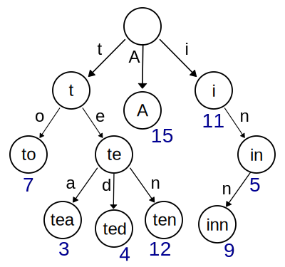

# LpSearch - Um dicionário de palavras

Software acadêmico. Dicionário de palavras implementado como uma **trie** - uma estrutura de dados árvore usada para armazenar pares chave/valor; um nó da árvore não armazena a chave à qual está associado, em vez disso, a posição dele na árvore define a chave à qual ele está associado; todos os descendentes de um nó possuem um prefixo de chave em comum; um valor é associado a cada chave. Neste programa, as chaves são as palavras e os valores são suas descrições. 

Cada nó da árvore guarda uma letra de uma palavra. Sendo assim, um caminho da árvore forma uma palavra (chave) e palavras diferentes com o mesmo prefixo reaproveitam a parte em comum de seus caminhos. O programa sugere palavras que completam a que o usuário estiver digitando durante uma busca no dicionário, aprofundando-se pela árvore a partir do nó cujos ascendentes guardem, em ordem correta de cima para baixo, as letras já digitadas pelo usuário.

*Ilustração de uma trie, autor: Booyabazooka (based on PNG image by Deco). Modifications by Superm401.*

## Funcionalidades

* Gerênciamento persistente de palavras e suas respectivas descrições;
* Busca por descrições de palavras cadastradas.

## Requisitos

Sistema operacional Linux.

## Compilação

Da pasta raiz do projeto, execute:

`make`

## Execução

Após compilar, ainda na pasta raiz do projeto, execute:

`./lpsearch`

## Author

LpSearch was originally created by Peterson Daronch de Bem (Petch) in 2016.

petersondaronch@gmail.com

